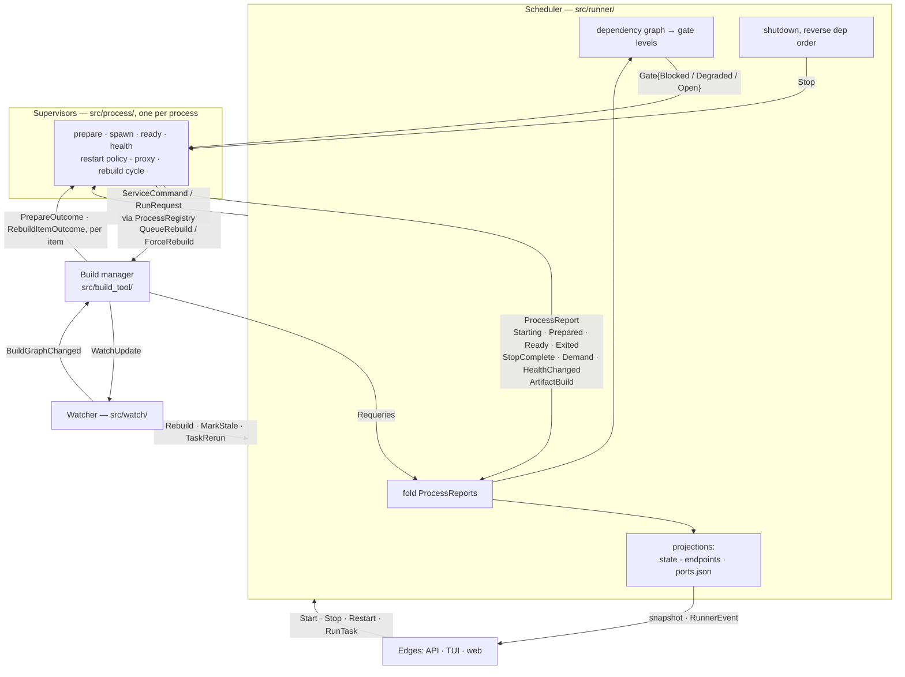
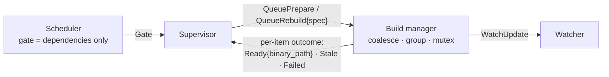

# Who owns what

Don is four cooperating actors. This document says what each one owns, what it
may never do, and what the signals between them are. It exists because the
boundaries erode in one specific way: someone needs a fact, notices another
component already has it, and reads it from there — and a year later nobody
can answer "why did X restart?" without reading every module.

> **The invariant, stated once:**
> **Commands flow down. Reports flow up. Peers never command peers.**
>
> Addressed commands into a process come only from the scheduler and the edges
> (API, TUI, watcher), via `ProcessRegistry` — so "who can stop a service?"
> stays a two-line grep. Processes report transitions; anything that cares
> *observes*. A supervisor never holds another process's handle.

## The actors

| Actor | Owns | Must never |
|---|---|---|
| **Scheduler** (`src/runner/`) | dependency graph, gate levels, the fold over reports, the state/endpoint/ports projections, shutdown order | hold a pid, a handle or a port binding; decide when a process restarts |
| **Supervisor** (`src/process/`) | one process end to end: prepare, spawn, ready check, health monitor, restart policy, its proxy, its rebuild cycle | command a peer; import anything from `runner` |
| **Build manager** (`src/build_tool/`) | *every* build — the first as much as a rebuild: coalescing across processes, workspace grouping, the bazel mutex, watch-path and binary-path resolution, the mtime scan that catches an edit made mid-build | know about dependencies or lifecycle state |
| **Watcher** (`src/watch/`) | file watching, debounce, per-item watch state and registrations | decide what a change *means* |

Two of these edges are enforced by `tests/module_edges_test.rs` rather than by
convention: `src/process/` must not reference `crate::runner`, and neither
must `src/tui/`. Both erode the same way — by reaching for a runner type that
already has the fact you want.

## Signals



Reports travel on one **lossless unbounded mpsc** to the scheduler, not on the
broadcast: the scheduler must never lag its own inputs. The broadcast is for
peers and edges, which resync from the snapshot when they lag.

## A start, end to end

```mermaid
sequenceDiagram
    participant Sch as Scheduler
    participant Sup as Supervisor
    participant Proc as Process

    Note over Sch: dependencies satisfied
    Sch->>Sup: Gate = Open{rev}
    Note over Sup: spends its one-shot demand<br/>(a level alone would double-start)
    Sup->>Sch: ServiceStarting
    Note over Sch: → Starting (closes the gate)
    Sup->>Proc: spawn
    Sup->>Sch: ServiceStartPrepared{wired: pid, ports}
    Note over Sch: → Running; custody funnel writes<br/>the snapshot, endpoints, ports.json
    Sup->>Sup: ready check, against its own proxy/docker state
    Sup->>Sch: ServiceReady{success}
    Note over Sch: → Ready
```

The scheduler says *when*, never *how*. It learns the pid from the report and
writes it straight into the projection — it keeps no copy of its own.

## A crash

```mermaid
sequenceDiagram
    participant Sup as Supervisor
    participant Pol as RestartPolicy
    participant Sch as Scheduler

    Note over Sup: output stream EOF — the process died
    Sup->>Sup: reap, narrate "exited unexpectedly…"
    Sup->>Pol: decide(Crash{lived, reached_ready})
    Pol-->>Sup: RestartScheduled{attempt, backoff} | GaveUp… | LazyRearm
    Note over Sup: arms its own backoff timer<br/>(a select arm, not a detached task)
    Sup->>Sch: ServiceExited{status, policy}
    Note over Sch: → Failed; records restart_pending<br/>so a stack in backoff is not "settled"
    Note over Sup: backoff fires → internal Restart
```

Whether a service starts again is the supervisor's answer, because every input
the question needs — did the prepare fail, did the ready check pass, how long
did this spawn live — is something it observed itself. The scheduler folds
enough to keep its own view honest and nothing more.

Two rules the crash path depends on:

- **Demand is one-shot.** A gate level alone double-starts: gate opens,
  process dies instantly, gate is still open, idle supervisor starts again at
  zero backoff. Demand is cleared in the same synchronous step that begins the
  start. A restart the policy scheduled arrives as its own mailbox command and
  does not consult demand — *a crash is not a request*.
- **The reset flag is load-bearing.** An explicit stop or restart clears the
  failure history; the policy's own retry must not, or the streak that bounds
  a crash loop is wiped by every attempt it schedules.

## Building

Startup, lazy JIT and rebuild are one sentence: *a supervisor that needs an
artifact asks the build manager for one.*



The scheduler does not appear in it. It learns that a build is running the
way it learns everything else — from a report — and folds it into `Building`
so `don status` can say so, so `initial_startup_settled` stays open while one
runs, and so a rebuild requested mid-build is deferred rather than raced. It
never decides that a build should happen, and the gate means only what
`src/gate.rs` says it means.

The load-bearing detail:

> **Dependencies gate *running*, not *building*.**

An artifact can be built before its dependencies are up — bazel does not care
whether postgres is listening. So a supervisor requests its build **when it is
constructed**, not when its gate opens. Every supervisor asks at once, the
debounce window coalesces them, and bazel gets one invocation for the whole
workspace. Building at gate-open would serialise builds along the dependency
chain, which is the one real regression this ordering avoids by construction.
Lazy services are the exception for the reason that makes the rule: nothing
wants one yet, so its supervisor asks on first demand.

One request is late by construction, and it is why nothing builds the instant
`Runner::new` returns. Watch paths are resolved *by* these builds and have to
reach the watcher before anything spawns — but the watcher does not exist
until the runner has set it up. The build manager parks preparation requests
until the runner says `WatchReady`, which is also what guarantees the whole
startup burst leaves as one batch. A supervisor then waits for its outcome
before spawning, so the registrations are always in place first.

### Two rules that come with it

**Build failures do not retry; runtime failures do.** Retrying a compile that
just failed recompiles the same broken code. The restart policy exists for
crashes, unhealthy probes and ready-check failures — things where waiting can
plausibly change the answer. A supervisor whose build fails withdraws its own
demand, so the failure never reaches `RestartPolicy` at all; only an explicit
request by name starts that process again.

**The startup mtime scan survives.** `run_batch_build_chain` stamps a
timestamp before building and afterwards checks whether any watched source or
BUILD file is newer, reporting `PrepareOutcome::Stale` — "you edited a file
while the build was running, so build again before starting". That looks like
the rebuild cycle's staleness flag but cannot be merged with it: the cycle
learns staleness from the *watcher*, and during this build nothing is watching
those paths yet, because the watch paths are resolved **by that build**. The
mtime scan is the only thing covering that bootstrap window. It lives in the
build manager with the rest of the chain, and the supervisor answers it by
asking again.

## Reading state

A status query must never queue behind whatever the scheduler is doing, so
reads go through projections rather than the command channel:

- **`state_store.rs`** — every process's `ProcessStatus`, plus
  `startup_complete`. `StateWriter` is not `Clone` and lives on the scheduler;
  `StateReader` is cloneable and read-only. For runtime detail the snapshot
  *is* the record, not a copy of one — pid, docker-ness and port mappings live
  only in `ProcessStatus::Service.runtime`.
- **`endpoints.rs`** — where every service can be reached. Supervisors render
  their own `$(peer.KEY)` env from it at start time, which is why a peer that
  moved is picked up without the request being reissued.
- **`gate.rs`** — per-process permission to run.
- **`output/attach.rs`**, **`watch/report.rs`** — attach sessions and watch
  state, answered by their owners.

The state store and the `RunnerEvent` broadcast update on exactly the same
transitions, which is what lets a consumer that missed an event resync from
the snapshot and get a consistent answer.
